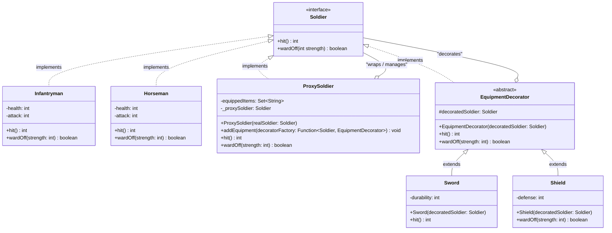
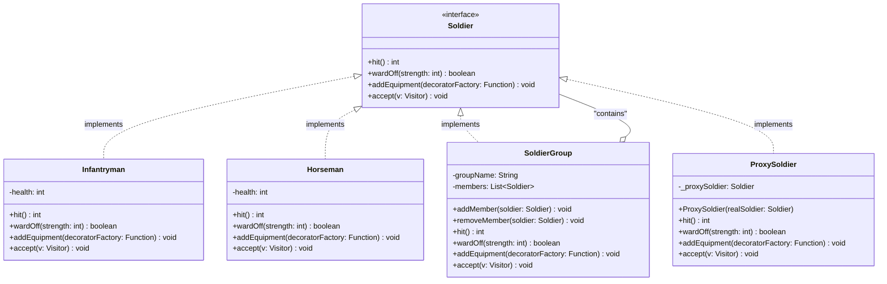
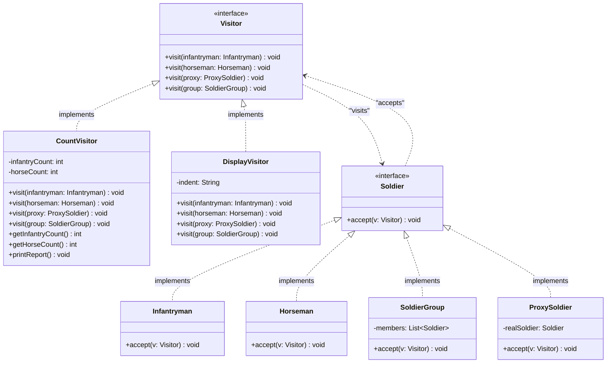
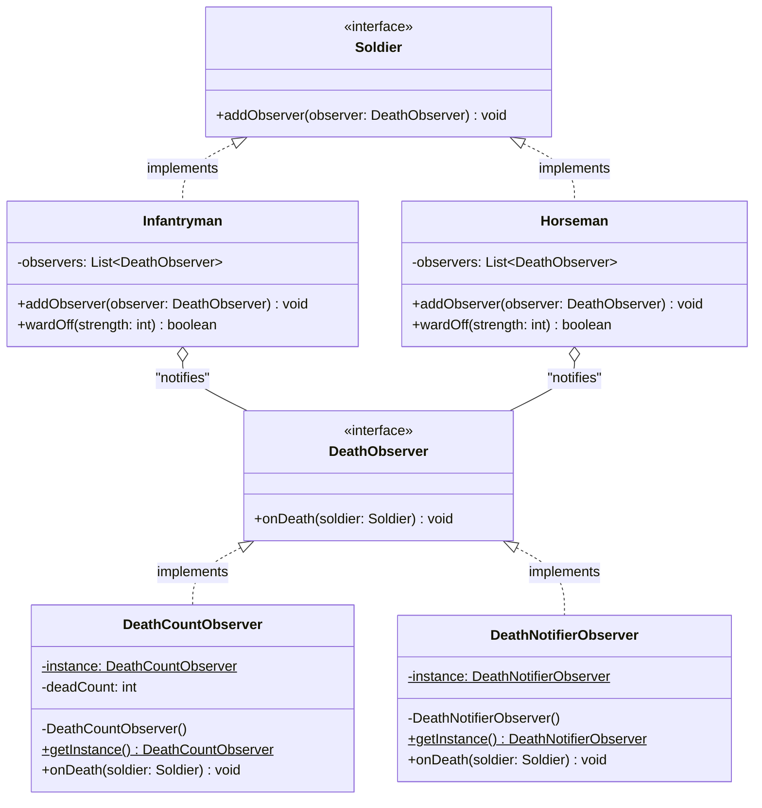
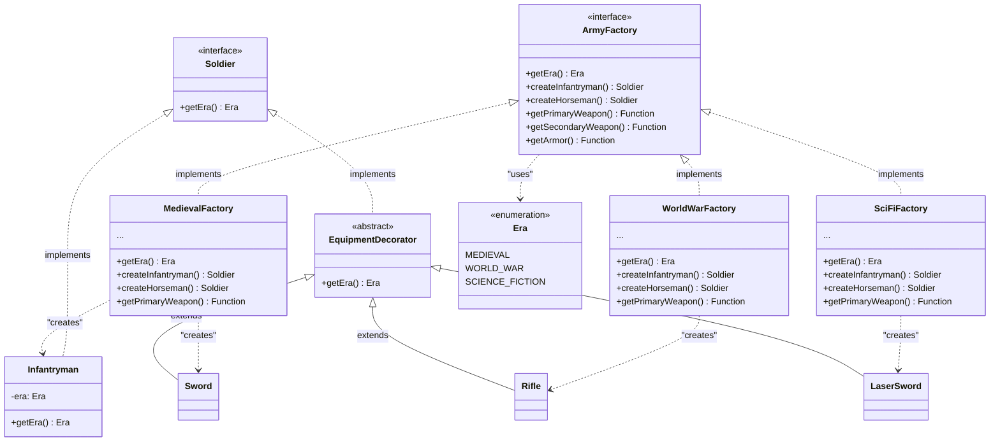

## Phần 1:
### 1.1. Decorator Pattern

**Trả lời câu hỏi:**  
> **câu hỏi 5**. Theo Decorator Pattern, "chức năng của đối tượng trở nên phong phú hơn" – điều này có đúng trong trường hợp này không? Giải thích.      
Đúng vì một binh lính ban đầu (Infantry, Horseman) chỉ có hành vi cơ bản với hit(), wardoff() mặc định, khi áp dụng Decorator Pattern thì các lớp này được bọc bởi class Decorator wrappee là EquipmentDecorator mà không thay đổi code lớp gốc và có thể linh hoạt kết hợp ở runtime. Do đó, một đối tượng sau khi được bọc sẽ có thêm hành vi mới làm trở nên phong phú hơn ban đầu đồng thời tuân thủ quy tắc Open/Close Principle (OCP).

> **câu hỏi 6**. Một binh lính không thể mang hai trang bị cùng loại" – Decorator có phù hợp không?
Không, vì Decorator cho phép bọc đối tượng một cách tự do. Decorator Pattern không có cơ chế kiểm soát số lượng decorator, loại decorator đã được dùng. Nếu cố gắng kiểm tra trong mỗi decorator sẽ vi phạm SRP.

### 1.2. Proxy Pattern
- **Proxy Pattern** giúp tăng cường chức năng cho đối tượng thông qua lớp trung gian (Proxy). Trong ví dụ này, `SoldierProxy` không chỉ đơn thuần là một bản sao của `Soldier` mà còn có thêm khả năng quản lý trang bị. Khi người dùng gọi phương thức `addEquipment`, Proxy sẽ kiểm tra tính hợp lệ (ví dụ: không trùng lặp) trước khi thực sự thay đổi đối tượng thực (`realSoldier`). Điều này làm cho Proxy trở nên "phong phú" hơn so với đối tượng gốc vì nó có thêm logic điều khiển và quản lý, đồng thời vẫn tuân thủ nguyên tắc OCP vì không sửa đổi lớp `Soldier` gốc.

### 1.3. Thiết bị hao mòn

Trang bị (Sword và Shield) được thiết kế để hao mòn sau mỗi lần sử dụng. Điều này được thực hiện bằng cách giảm dần các thuộc tính của trang bị sau mỗi lần sử dụng:

- **Sword**: Giảm dần `bonusDamage` sau mỗi lần chém.
- **Shield**: Giảm dần `blockRatio` sau mỗi lần đỡ đòn.

Khi trang bị bị hao mòn đến mức không còn tác dụng, nó sẽ không còn ảnh hưởng đến hành vi của binh lính nữa.
Việc này "trong suốt" vì Client vẫn chỉ gọi hit() và wardOff().

## Phần 2:

### 2.1. Composite Pattern

Composite Pattern (Mẫu cấu trúc Hợp thể) được áp dụng để tổ chức binh lính lại thành các nhóm đội hình. Pattern cho phép chúng ta xử lý một nhóm các binh lính (`SoldierGroup`) và từng binh lính riêng lẻ (`Infantryman`, `Horseman`, hoặc Lính bọc trong qua lớp `ProxySoldier`) thông qua chung một interface cơ sở (`Soldier`).

Bằng việc coi một Nhóm lính hệt như một đối tượng Lính thông thường, ta có thể xây dựng nên cấu trúc cây phân cấp (Tree structure) như ngoài đời thực. Ví dụ: Một Đại đội chứa các Trung đội, mỗi Trung đội lại chứa nhiều binh lính riêng lẻ. Khi ta ra lệnh `hit()`, toàn bộ cấu trúc cây sẽ đệ quy và lan truyền xuống từng chiếc lá (Leaf) để tính tổng sát thương. Điều này làm cho Client (hàm main) tương tác với mảng khối 1 vạn lính giống hệt cách tương tác với 1 lính đơn lẻ.

---

### 2.2. Visitor Pattern

Visitor Pattern (Mẫu Khách Yếng Thăm) đặc biệt hiệu quả trong việc bóc tách các thuật toán thống kê/truy xuất dữ liệu khỏi cấu trúc liên kết mạng lưới chằng chịt của các đối tượng gốc.

Trong dự án này, hệ thống đối tượng `Soldier`, `SoldierGroup`, `ProxySoldier`, `EquipmentDecorator` được tổ chức lồng nhau (do áp dụng chung Decorator, Proxy và Composite). Giả sử hệ thống phát sinh nhu cầu: **"Đếm số lượng bộ binh và kỵ binh thực sự có trong trận"** hay **"Hiển thị cây cấu trúc toàn bộ đội hình"**. Nếu cứ tiếp tục nhét 2 hàm này vào Interface `Soldier`, ta ép toàn bộ hàng chục class con phải code lại 2 thiết kế mới, vi phạm trầm trọng quy tắc Open/Closed Principle (OCP) và Single Responsibility Principle (SRP).

Thay vì vậy, chúng ta thiết lập giao thức rẽ nhánh (Double-dispatch) thông qua lời gọi hàm `accept(Visitor v)` tại Interface nguyên thủ. Các khách rà soát là `CountVisitor` chuyên đi đếm và `DisplayVisitor` chuyên đi in kết quả, chúng luồn sâu xuống từng `SoldierGroup`, truy cập từng `member`, và khi đụng `ProxySoldier`, nó sẽ bóc tách mọi lớp bọc `EquipmentDecorator` ra để đếm chuẩn Lính dưới cùng. Client cực kỳ gọn gàng, hệ thống Core Data không hề bị nhiễm bẩn!

## Phần 3:
### 3.1. Observer Pattern

Observer Pattern được sử dụng để thiết lập một mạng lưới lắng nghe sự kiện thời gian thực (Event-driven). Cụ thể ở đây là sự kiện "Tử trận". 
Thay vì hệ thống phải chủ động dùng vòng lặp để liên tục (polling) quét qua mảng lính xem máu (`health`) của ai đã tụt xuống 0 để báo cáo, chúng ta đảo ngược luồng điều khiển (Inversion of Control). Các chiến binh (`Infantryman`, `Horseman`) chứa một danh sách `DeathObserver`. Ngay khi chịu sát thương chí mạng, tự họ sẽ hô hoán lên: `onDeath(this)`. Bằng cách nối đuôi theo mô hình Composite, một `Observer` đi vào `SoldierGroup` (Đại đội) sẽ tự động luồn rễ lan tỏa xuống tận từng binh sĩ tinh chuẩn nhất.

### 3.2. Singleton Pattern

> Tại sao Singleton có ý nghĩa trong bối cảnh theo dõi trận chiến?

Trong bối cảnh theo dõi và giám sát diễn biến trận chiến, giới hạn `Singleton` lại là điểm mấu chốt quyết định tính chính xác của dữ liệu:
1. **Bảo Toàn Số Đếm Duy Nhất (Single Source of Truth) đối với `DeathCountObserver`**: 
   Observer đếm số mạng tử trận sở hữu state nội bộ (là thuộc tính `int deadCount`). Nếu tồn tại nhiều instance cùng gắn lên Lính, hoặc Quân Đội 1 gắn 1 cái, Quân Đội 2 tạo `new` và gắn 1 cái khác, thì số `deadCount` sẽ bị phân mảnh và tính toán song song, dẫn tới kết quả sai lệch khi in "Tổng số binh lính đã tử trận". Đảm bảo Singleton sẽ giữ 100% tỷ lệ tính toán tập trung trên 1 biến counter duy nhất.
2. **Tiết Kiệm Tài Nguyên (Resource Management) đối với `DeathNotifierObserver`**:
   Observer chịu trách nhiệm ghi nhận các binh sĩ ngã xuống và thao tác IO/Networking (giả lập gửi Email tử sĩ). Việc tạo ra nhiều instance không có State như thế này chỉ để lắng nghe Event là một sự lãng phí Memory, và nếu gắn nhầm 2 instance khác nhau lên một ông lính, email sẽ bị gửi đúp 2 lần (Spamming). Singleton giúp xử lý gọn nhẹ vấn đề bộ nhớ và chặn mọi rủi ro về trùng lặp logic hệ thống.

### 3.3. Abstract Factory Pattern

Abstract Factory giải quyết trọn vẹn rắc rối khi kho khí tài quân sự phình to qua nhiều thời đại lịch sử khác nhau (Medieval, World War, Science Fiction). 

Mẫu thiết kế này đảm bảo các đối tượng "Binh lính" và "Trang bị" được sinh ra theo đúng bộ (Family). Ví dụ, nếu sử dụng `MedievalFactory`, hệ thống bảo đảm nhả ra lính Cầm Kiếm, Đeo Giáp lưới. Ngược lại, nếu dùng `SciFiFactory`, sẽ nhả ra lính sử dụng Vũ Khí Sinh Học và Giáp Nano.

Điểm đắt giá nhất là tính năng "Gác cổng" tại `ProxySoldier`. Bất kể Client (Hàm main) có cố tình nhét một món vũ khí sai thời đại (ví dụ: Ép lính Trung Cổ dùng Súng Trường Thế Chiến) thì Proxy vẫn sẽ chặn đứng bằng lệnh so sánh Enum thông qua hợp đồng `getEra()`, từ chối buff Decorator rác lên người lính!

### Summary

```mermaid
classDiagram
    direction TB

    %% ═══════════════════════════════════════════
    %% ENUM
    %% ═══════════════════════════════════════════
    class Era {
        <<enumeration>>
        MEDIEVAL
        WORLD_WAR
        SCIENCE_FICTION
    }

    %% ═══════════════════════════════════════════
    %% COMPOSITE PATTERN  -  Component + Leaf + Composite
    %% ═══════════════════════════════════════════
    class Soldier {
        <<interface>>
        +hit() int
        +wardOff(int strength) boolean
        +accept(Visitor v) void
        +addObserver(DeathObserver observer) void
        +getEra() Era
    }

    class Infantryman {
        -int health
        -Era era
        -List~DeathObserver~ observers
        +Infantryman(Era era)
    }

    class Horseman {
        -int health
        -Era era
        -List~DeathObserver~ observers
        +Horseman(Era era)
    }

    class SoldierGroup {
        -String name
        -List~Soldier~ members
        -List~DeathObserver~ observers
        +addMember(Soldier soldier) void
        +removeMember(Soldier soldier) void
        +addEquipment(Function decoratorFactory) void
        +getName() String
        +getMembers() List~Soldier~
    }

    Soldier <|.. Infantryman : implements
    Soldier <|.. Horseman : implements
    Soldier <|.. SoldierGroup : implements
    SoldierGroup "1" o-- "*" Soldier : contains members

    %% ═══════════════════════════════════════════
    %% PROXY PATTERN
    %% ═══════════════════════════════════════════
    class ProxySoldier {
        -Soldier realSoldier
        -Set~String~ equippedItems
        +addEquipment(Function decoratorFactory) void
        +getRealSoldier() Soldier
    }

    Soldier <|.. ProxySoldier : implements
    ProxySoldier "1" o-- "1" Soldier : wraps realSoldier

    %% ═══════════════════════════════════════════
    %% DECORATOR PATTERN
    %% ═══════════════════════════════════════════
    class EquipmentDecorator {
        <<abstract>>
        #Soldier decoratedSoldier
        +getDecoratedSoldier() Soldier
    }

    Soldier <|.. EquipmentDecorator : implements
    EquipmentDecorator "1" o-- "1" Soldier : decorates

    %% --- Medieval Equipment (Era.MEDIEVAL) ---
    class Sword {
        -int bonusDamage
    }
    class Shield {
        -double blockRatio
    }
    class Spear {
        -int uses
    }
    class Armor {
        -int durability
    }

    EquipmentDecorator <|-- Sword : extends
    EquipmentDecorator <|-- Shield : extends
    EquipmentDecorator <|-- Spear : extends
    EquipmentDecorator <|-- Armor : extends

    %% --- World War Equipment (Era.WORLD_WAR) ---
    class Rifle {
        -int ammo
    }
    class Grenade {
        -int count
    }
    class Helmet {
    }

    EquipmentDecorator <|-- Rifle : extends
    EquipmentDecorator <|-- Grenade : extends
    EquipmentDecorator <|-- Helmet : extends

    %% --- Sci-Fi Equipment (Era.SCIENCE_FICTION) ---
    class LaserSword {
    }
    class BioWeapon {
        -int uses
    }
    class NanoArmor {
    }

    EquipmentDecorator <|-- LaserSword : extends
    EquipmentDecorator <|-- BioWeapon : extends
    EquipmentDecorator <|-- NanoArmor : extends

    %% ═══════════════════════════════════════════
    %% ABSTRACT FACTORY PATTERN
    %% ═══════════════════════════════════════════
    class ArmyFactory {
        <<interface>>
        +getEra() Era
        +createInfantryman() Soldier
        +createHorseman() Soldier
        +getPrimaryWeapon() Function
        +getSecondaryWeapon() Function
        +getArmor() Function
    }

    class MedievalFactory {
    }
    class WorldWarFactory {
    }
    class SciFiFactory {
    }

    ArmyFactory <|.. MedievalFactory : implements
    ArmyFactory <|.. WorldWarFactory : implements
    ArmyFactory <|.. SciFiFactory : implements

    ArmyFactory ..> Soldier : creates
    ArmyFactory ..> EquipmentDecorator : provides class
    ArmyFactory ..> Era : uses

    %% ═══════════════════════════════════════════
    %% VISITOR PATTERN
    %% ═══════════════════════════════════════════
    class Visitor {
        <<interface>>
        +visit(SoldierGroup) void
        +visit(Infantryman) void
        +visit(Horseman) void
        +visit(ProxySoldier) void
        +visit(EquipmentDecorator) void
    }

    class DisplayVisitor {
        -String indent
    }

    class CountVisitor {
        -int infantryCount
        -int horsemanCount
        +getInfantryCount() int
        +getHorsemanCount() int
    }

    Visitor <|.. DisplayVisitor : implements
    Visitor <|.. CountVisitor : implements
    Soldier ..> Visitor : accepts

    %% ═══════════════════════════════════════════
    %% OBSERVER + SINGLETON PATTERN
    %% ═══════════════════════════════════════════
    class DeathObserver {
        <<interface>>
        +onDeath(Soldier soldier) void
    }

    class DeathCountObserver {
        <<Singleton>>
        -static DeathCountObserver instance$
        -int deadCount
        -DeathCountObserver()
        +getInstance()$ DeathCountObserver
    }

    class DeathNotifierObserver {
        <<Singleton>>
        -static DeathNotifierObserver instance$
        -DeathNotifierObserver()
        +getInstance()$ DeathNotifierObserver
    }

    DeathObserver <|.. DeathCountObserver : implements
    DeathObserver <|.. DeathNotifierObserver : implements
    Soldier ..> DeathObserver : notifies on death
```

