## Phần 1:
### 1.1. Decorator Pattern

**Trả lời câu hỏi:**  
> **câu hỏi 5**. Theo Decorator Pattern, "chức năng của đối tượng trở nên phong phú hơn" – điều này có đúng trong trường hợp này không? Giải thích.      
Đúng vì một binh lính ban đầu (Infantry, Horseman) chỉ có hành vi cơ bản với hit(), wardoff() mặc định, khi áp dụng Decorator Pattern thì các lớp này được bọc bởi class Decorator wrappee là EquipmentDecorator mà không thay đổi code lớp gốc và có thể linh hoạt kết hợp ở runtime. Do đó, một đối tượng sau khi được bọc sẽ có thêm hành vi mới làm trở nên phong phú hơn ban đầu đồng thời tuân thủ quy tắc Open/Close Principle (OCP).

> **câu hỏi 6**. Một binh lính không thể mang hai trang bị cùng loại" – Decorator có phù hợp không?
Không, vì Decorator cho phép bọc đối tượng một cách tự do. Decorator Pattern không có cơ chế kiểm soát số lượng decorator, loại decorator đã được dùng. Nếu cố gắng kiểm tra trong mỗi decorator sẽ vi phạm SRP.

### 1.2. Proxy Pattern
- **Proxy Pattern** giúp tăng cường chức năng cho đối tượng thông qua lớp trung gian (Proxy). Trong ví dụ này, `SoldierProxy` không chỉ đơn thuần là một bản sao của `Soldier` mà còn có thêm khả năng quản lý trang bị. Khi người dùng gọi phương thức `addEquipment`, Proxy sẽ kiểm tra tính hợp lệ (ví dụ: không trùng lặp) trước khi thực sự thay đổi đối tượng thực (`realSoldier`). Điều này làm cho Proxy trở nên "phong phú" hơn so với đối tượng gốc vì nó có thêm logic điều khiển và quản lý, đồng thời vẫn tuân thủ nguyên tắc OCP vì không sửa đổi lớp `Soldier` gốc.

### 1.3. Thiết bị hao mòn

Trang bị (Sword và Shield) được thiết kế để hao mòn sau mỗi lần sử dụng. Điều này được thực hiện bằng cách giảm dần các thuộc tính của trang bị sau mỗi lần sử dụng:

- **Sword**: Giảm dần `bonusDamage` sau mỗi lần chém.
- **Shield**: Giảm dần `blockRatio` sau mỗi lần đỡ đòn.

Khi trang bị bị hao mòn đến mức không còn tác dụng, nó sẽ không còn ảnh hưởng đến hành vi của binh lính nữa.
Việc này "trong suốt" vì Client vẫn chỉ gọi hit() và wardOff().

```mermaid
classDiagram
    class Soldier {
        <<interface>>
        +hit() int
        +wardOff(int strength) boolean
    }

    class Infantryman {
        -health: int
        -attack: int
        +hit() int
        +wardOff(strength: int) boolean
    }

    class Horseman {
        -health: int
        -attack: int
        +hit() int
        +wardOff(strength: int) boolean
    }

    class ProxySoldier {
        -equippedItems: Set~String~
        -_proxySoldier: Soldier
        +ProxySoldier(realSoldier: Soldier)
        +addEquipment(decoratorFactory: Function~Soldier, EquipmentDecorator~) void
        +hit() int
        +wardOff(strength: int) boolean
    }

    class EquipmentDecorator {
        <<abstract>>
        #decoratedSoldier: Soldier
        +EquipmentDecorator(decoratedSoldier: Soldier)
        +hit() int
        +wardOff(strength: int) boolean
    }

    class Sword {
        -durability: int
        +Sword(decoratedSoldier: Soldier)
        +hit() int
    }

    class Shield {
        -defense: int
        +Shield(decoratedSoldier: Soldier)
        +wardOff(strength: int) boolean
    }

    %% Relationships
    Soldier <|.. Infantryman : implements
    Soldier <|.. Horseman : implements
    Soldier <|.. ProxySoldier : implements
    Soldier <|.. EquipmentDecorator : implements

    %% Decorator Hierarchy
    EquipmentDecorator <|-- Sword : extends
    EquipmentDecorator <|-- Shield : extends

    %% Composition/Aggregation
    ProxySoldier o-- Soldier : "wraps / manages"
    EquipmentDecorator o-- Soldier : "decorates"
```

