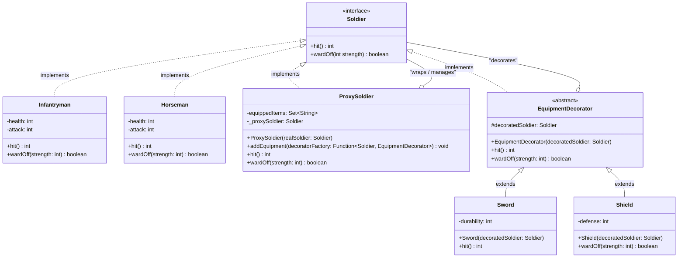

## Phần 1:
### 1.1. Decorator Pattern

**Trả lời câu hỏi:**  
> **câu hỏi 5**. Theo Decorator Pattern, "chức năng của đối tượng trở nên phong phú hơn" – điều này có đúng trong trường hợp này không? Giải thích.      
Đúng vì một binh lính ban đầu (Infantry, Horseman) chỉ có hành vi cơ bản với hit(), wardoff() mặc định, khi áp dụng Decorator Pattern thì các lớp này được bọc bởi class Decorator wrappee là EquipmentDecorator mà không thay đổi code lớp gốc và có thể linh hoạt kết hợp ở runtime. Do đó, một đối tượng sau khi được bọc sẽ có thêm hành vi mới làm trở nên phong phú hơn ban đầu đồng thời tuân thủ quy tắc Open/Close Principle (OCP).

> **câu hỏi 6**. Một binh lính không thể mang hai trang bị cùng loại" – Decorator có phù hợp không?
Không, vì Decorator cho phép bọc đối tượng một cách tự do. Decorator Pattern không có cơ chế kiểm soát số lượng decorator, loại decorator đã được dùng. Nếu cố gắng kiểm tra trong mỗi decorator sẽ vi phạm SRP.


### 1.2. Proxy Pattern
- **Proxy Pattern** giúp tăng cường chức năng cho đối tượng thông qua lớp trung gian (Proxy). Trong ví dụ này, `SoldierProxy` không chỉ đơn thuần là một bản sao của `Soldier` mà còn có thêm khả năng quản lý trang bị. Khi người dùng gọi phương thức `addEquipment`, Proxy sẽ kiểm tra tính hợp lệ (ví dụ: không trùng lặp) trước khi thực sự thay đổi đối tượng thực (`realSoldier`). Điều này làm cho Proxy trở nên "phong phú" hơn so với đối tượng gốc vì nó có thêm logic điều khiển và quản lý, đồng thời vẫn tuân thủ nguyên tắc OCP vì không sửa đổi lớp `Soldier` gốc.


### 1.3. Thiết bị hao mòn

Trang bị (Sword và Shield) được thiết kế để hao mòn sau mỗi lần sử dụng. Điều này được thực hiện bằng cách giảm dần các thuộc tính của trang bị sau mỗi lần sử dụng:

- **Sword**: Giảm dần `bonusDamage` sau mỗi lần chém.
- **Shield**: Giảm dần `blockRatio` sau mỗi lần đỡ đòn.

Khi trang bị bị hao mòn đến mức không còn tác dụng, nó sẽ không còn ảnh hưởng đến hành vi của binh lính nữa.
Việc này "trong suốt" vì Client vẫn chỉ gọi hit() và wardOff().



## Phần 2:

### 2.1. Composite Pattern

Composite Pattern (Mẫu cấu trúc Hợp thể) được áp dụng để tổ chức binh lính lại thành các nhóm đội hình. Pattern cho phép chúng ta xử lý một nhóm các binh lính (`SoldierGroup`) và từng binh lính riêng lẻ (`Infantryman`, `Horseman`, hoặc Lính bọc trong qua lớp `ProxySoldier`) thông qua chung một interface cơ sở (`Soldier`).

Bằng việc coi một Nhóm lính hệt như một đối tượng Lính thông thường, ta có thể xây dựng nên cấu trúc cây phân cấp (Tree structure) như ngoài đời thực. Ví dụ: Một Đại đội chứa các Trung đội, mỗi Trung đội lại chứa nhiều binh lính riêng lẻ. Khi ta ra lệnh `hit()`, toàn bộ cấu trúc cây sẽ đệ quy và lan truyền xuống từng chiếc lá (Leaf) để tính tổng sát thương. Điều này làm cho Client (hàm main) tương tác với mảng khối 1 vạn lính giống hệt cách tương tác với 1 lính đơn lẻ.


---

### 2.2. Visitor Pattern

Visitor Pattern (Mẫu Khách Yếng Thăm) đặc biệt hiệu quả trong việc bóc tách các thuật toán thống kê/truy xuất dữ liệu khỏi cấu trúc liên kết mạng lưới chằng chịt của các đối tượng gốc.

Trong dự án này, hệ thống đối tượng `Soldier`, `SoldierGroup`, `ProxySoldier`, `EquipmentDecorator` được tổ chức lồng nhau (do áp dụng chung Decorator, Proxy và Composite). Giả sử hệ thống phát sinh nhu cầu: **"Đếm số lượng bộ binh và kỵ binh thực sự có trong trận"** hay **"Hiển thị cây cấu trúc toàn bộ đội hình"**. Nếu cứ tiếp tục nhét 2 hàm này vào Interface `Soldier`, ta ép toàn bộ hàng chục class con phải code lại 2 thiết kế mới, vi phạm trầm trọng quy tắc Open/Closed Principle (OCP) và Single Responsibility Principle (SRP).

Thay vì vậy, chúng ta thiết lập giao thức rẽ nhánh (Double-dispatch) thông qua lời gọi hàm `accept(Visitor v)` tại Interface nguyên thủ. Các khách rà soát là `CountVisitor` chuyên đi đếm và `DisplayVisitor` chuyên đi in kết quả, chúng luồn sâu xuống từng `SoldierGroup`, truy cập từng `member`, và khi đụng `ProxySoldier`, nó sẽ bóc tách mọi lớp bọc `EquipmentDecorator` ra để đếm chuẩn Lính dưới cùng. Client cực kỳ gọn gàng, hệ thống Core Data không hề bị nhiễm bẩn!

```mermaid
classDiagram
    %% Visitor Interface
    class Visitor {
        <<interface>>
        +visit(infantryman: Infantryman) void
        +visit(horseman: Horseman) void
        +visit(proxy: ProxySoldier) void
        +visit(group: SoldierGroup) void
    }

    %% Concrete Visitors
    class CountVisitor {
        -infantryCount: int
        -horseCount: int
        +visit(infantryman: Infantryman) void
        +visit(horseman: Horseman) void
        +visit(proxy: ProxySoldier) void
        +visit(group: SoldierGroup) void
        +getInfantryCount() int
        +getHorseCount() int
        +printReport() void
    }

    class DisplayVisitor {
        -indent: String
        +visit(infantryman: Infantryman) void
        +visit(horseman: Horseman) void
        +visit(proxy: ProxySoldier) void
        +visit(group: SoldierGroup) void
    }

    %% Element Interface
    class Soldier {
        <<interface>>
        +accept(v: Visitor) void
    }

    %% Concrete Elements
    class Infantryman {
        +accept(v: Visitor) void
    }

    class Horseman {
        +accept(v: Visitor) void
    }

    class SoldierGroup {
        -members: List~Soldier~
        +accept(v: Visitor) void
    }

    class ProxySoldier {
        -realSoldier: Soldier
        +accept(v: Visitor) void
    }

    %% Relationships
    Visitor <|.. CountVisitor : implements
    Visitor <|.. DisplayVisitor : implements

    Soldier <|.. Infantryman : implements
    Soldier <|.. Horseman : implements
    Soldier <|.. SoldierGroup : implements
    Soldier <|.. ProxySoldier : implements

    Soldier ..> Visitor : "accepts"
    Visitor ..> Soldier : "visits"
```
